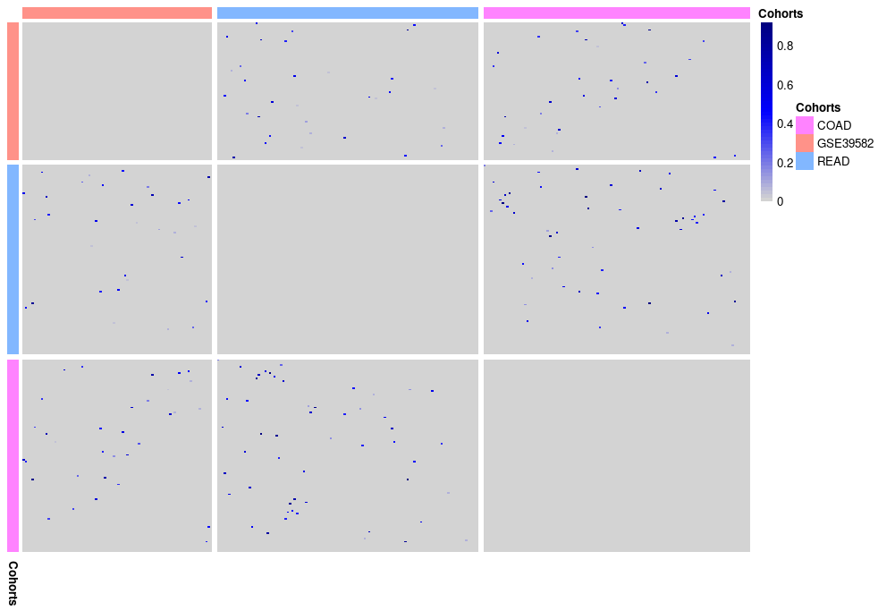

<!-- README.md is generated from README.Rmd. Please edit that file -->

```{r, include = FALSE}
knitr::opts_chunk$set(
  collapse = TRUE,
  comment = "#>",
  fig.path = "man/figures/README-",
  out.width = "100%", 
  eval = FALSE
)
```

# consensusNetR


<!-- badges: start -->
[](https://lifecycle.r-lib.org/articles/stages.html#experimental)
<!-- badges: end -->

consensusNetR is an R Package for combining networks into a consensus network based on the work of [Laura Cantini and Andrei Zinovyev](https://academic.oup.com/bioinformatics/article/35/21/4307/5426054). In addition to identifying consensus based on correlation of community meta-genes (loadings or membership scores), we also implement methods based on overlap. 

## Installation

Install the version from BMS BioGit with:

```{r}
remotes::install_github(
  repo = "Systems-Methods/consensusNetR"
)
```

or:

```{r}
remotes::install_git(
  "https://github.com/Systems-Methods/consensusNetR"
  )
```


# Example Workflow

This example will create a consensus network from three public datasets: 
[GSE39582](https://www.ncbi.nlm.nih.gov/geo/query/acc.cgi?acc=GSE39582), 
[TCGA COAD](https://portal.gdc.cancer.gov/projects/TCGA-COAD), and
[TCGA READ](https://portal.gdc.cancer.gov/projects/TCGA-READ)

This example workflow begins with 
[icWGCNA](https://systems-methods.github.io/icWGCNA/) results, however 
alternative methods work as well (KNN, PCA, ICA, WGCNA). See 
[Example Appendix] for downloading data and icWGCNA run details and code.

## Consensus construction

```{r Consensus-construction}

# Create list of community_membership object
memb_list <- list(
  GSE39582 = GSE39582_icwgcna$community_membership,
  READ = read_icwgcna$community_membership,
  COAD = coad_icwgcna$community_membership
)

# Construct Meta Reciprocal Best Hits based on overlaps
rbh <- construct_rbh_overlap_based(memb_list, top_n = 25)

# RBH Heatmap Creation
plot_rbh(rbh = rbh, memb_list = memb_list)

```




```{r Consensus-construction2}

# Detect Communities in Adjacency/Reciprocal Best Hits Matrix
consensus_comms <- detect_consensus_communities(rbh) 

# Compute the average metagene across studies for each community
consensus_memb  <- calc_consensus_memberships(consensus_comms, memb_list)

```

## Downstream Analysis

```{r Downstream-Analysis}

consensus_genes <- get_gene_community_membership(consensus_comms, memb_list, 2)

# Need to use icWGCNA for individual eigengenes
GSE39582_eigen <- icWGCNA::compute_eigengene_matrix(
                          ex = GSE39582_df,
                          membership_matrix = consensus_memb)
read_eigen <- icWGCNA::compute_eigengene_matrix(
                          ex = read_df,
                          membership_matrix = consensus_memb)
coad_eigen <- icWGCNA::compute_eigengene_matrix(
                          ex = coad_df,
                          membership_matrix = consensus_memb)

eigen_list = list(GSE39582_eigen, read_eigen, coad_eigen)
plot_consensus_eig_dist(eigen_list)

```

## Example Appendix 

<details><summary>Downloading data</summary>

For GSE39582 we need to convert from Affymetrix Human Genome U133 Plus 2.0 Array
to gene symbols, by using the `icWGCNA::gene_mapping()` function. This matches
with the two TCGA datasets already in gene symbols.

```{r downloading-data}

library(icWGCNA)

# GSE39582
GSE39582 <- GEOquery::getGEO("GSE39582")

# TCGA READ
UCSCXenaTools::getTCGAdata(
  project = "READ",
  mRNASeq = TRUE, 
  mRNASeqType = "normalized",
  clinical = TRUE, 
  download = TRUE, 
  destdir = "/MY_PATH/data/"
)

# TCGA COAD
UCSCXenaTools::getTCGAdata(
  project = "COAD",
  mRNASeq = TRUE, 
  mRNASeqType = "normalized",
  clinical = TRUE, 
  download = TRUE, 
  destdir = "/MY_PATH/data/"
)

```

</details>

<details><summary> Preprocessing steps</summary>

All datasets must have consistent annotation (i.e. Gene symbols, Entrez, 
Ensembl, ...). In this example we will convert GSE39582 to gene symbols using 
the [icWGCNA::gene_mapping()](https://systems-methods.github.io/icWGCNA/reference/gene_mapping.html) function.

```{r gene-mapping}

# creating annotation file for gene mapping to gene symbols
GSE39582_annotation <- GSE39582@featureData@data |>
  dplyr::select(ID, gene_symbol = `Gene Symbol`) |>  
  dplyr::mutate(
    gene_symbol = purrr::map(
      gene_symbol, ~ stringr::str_split(.x, " /// ")[[1]]
    )
  ) %>% 
  tidyr::unnest(gene_symbol)

GSE39582_hugo <- icWGCNA::gene_mapping(
  GSE39582@assayData$exprs, 
  GSE39582_annotation, 
  compress_fun = "highest_mean", 
  compress_trans = "log_exp"
)

```

All data should be normalized, however in this example we downloaded the 
normalized data so no transformations needed here.

</details>


<details><summary> icWGCNA runs</summary>

For icWGCNA runs using defaults, except reducing max iterations to 5 for 
demonstration purposes. These runs benefit greatly by using multiple 
computer cores.

```{r icWGCNA}

# GSE39582
GSE39582_icwgcna <- icWGCNA::icwgcna(GSE39582_hugo, maxIt = 5)

# TCGA READ
read_icwgcna <- icWGCNA::icwgcna(read_df, maxIt = 5)

# TCGA COAD
coad_icwgcna <- icWGCNA::icwgcna(coad_df, maxIt = 5)

```

</details>


# Code of Conduct
  
Please note that the icWGCNA project is released with a [Contributor Code of Conduct](https://contributor-covenant.org/version/2/0/CODE_OF_CONDUCT.html). By contributing to this project, you agree to abide by its terms.


